# Study Spaces

A collaborative study app where students join shared Study Spaces to learn together. Each space supports flashcard decks and rich-text notes. 

## Installation

### Option 1: Running locally
To run the Flutter project locally:

1. Ensure you have the Flutter SDK installed.
2. Clone this repository.
3. Run `flutter pub get` in your terminal to install dependencies.
4. Run `flutter run -d chrome` to launch the web version, or run it on a connected mobile emulator.

### Option 2: Installing APK (Android)
To install the app directly on an Android device:

1. Navigate to the "Releases" section.
2. Download the latest `study_spaces.apk` file.
3. Transfer the downloaded APK file to your Android device.
4. Open the file on your device to complete the installation and launch the app.

## How to Run
### 1. Authentication
Users can easily create a new account or log into an existing one using Supabase authentication.

  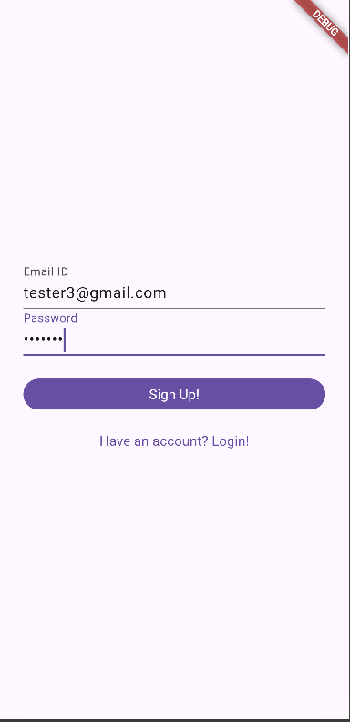
  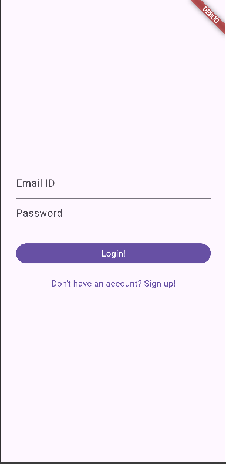

### 2. Creating Study Spaces
Your Home screen acts as a dashboard. The first icon on top right is to Join a study space, the second icon is to sign out and go back to Login page, and the third icon is to go to your profile. 

From here, you can create a brand new personal space by click on the "+" on bottom right.

  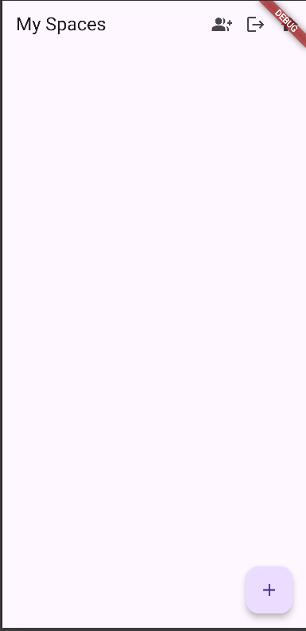
  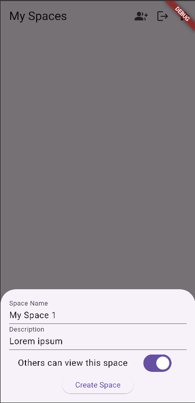
  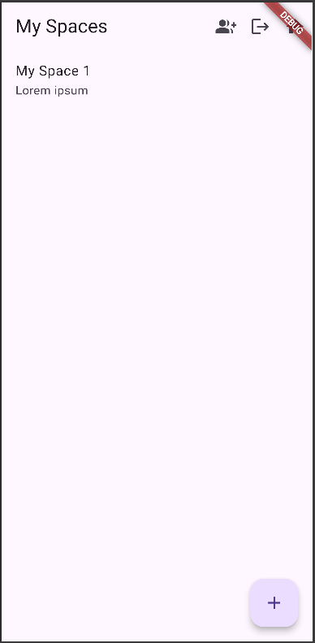

### 3. Flashcards & Decks
Inside a Space, you can create custom flashcard Decks. Once a deck is created, you can easily add, edit, or delete individual cards to build your study material.

  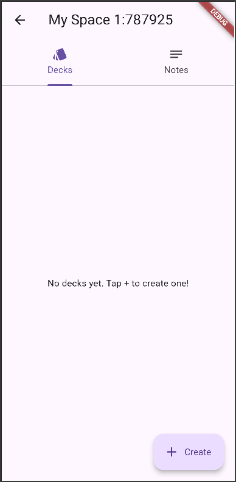
  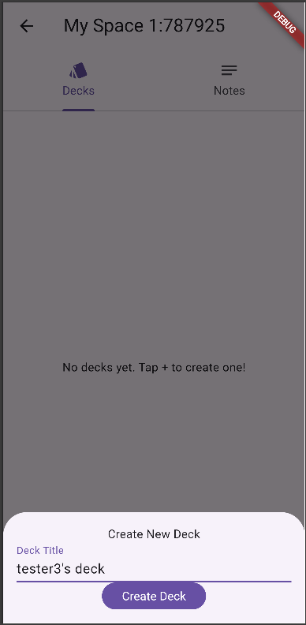
  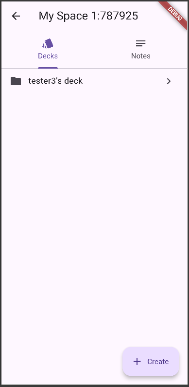
  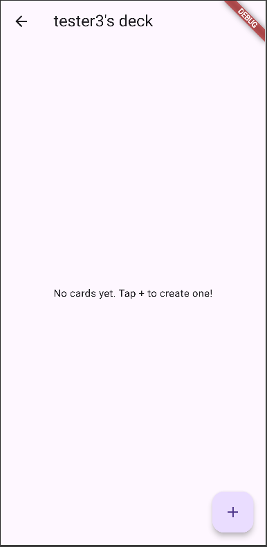

**Card Management:**

  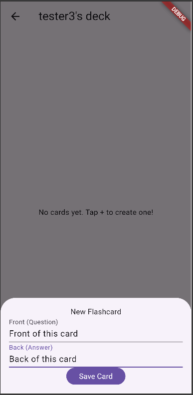
  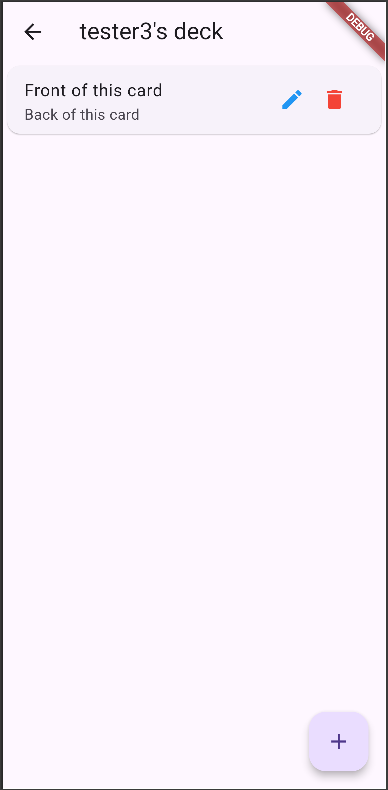
  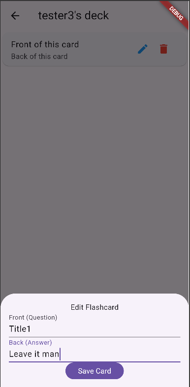
  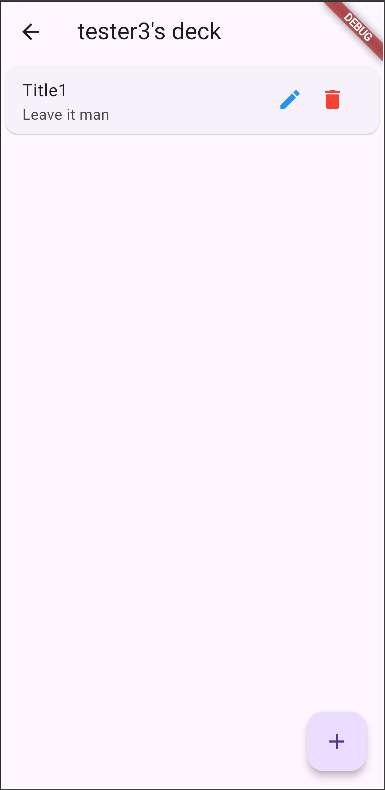
  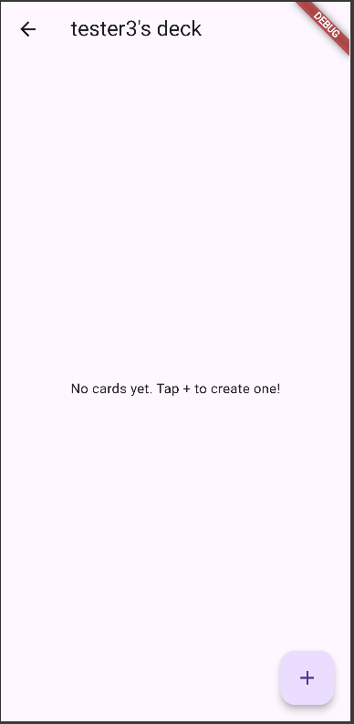

### 4. Notes (WIP)
Alongside flashcards, users can switch to the Notes tab to write, edit, and store rich-text notes directly within their study space.

  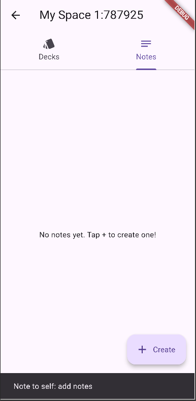

### 5. Joining Study Spaces
Alongside creating your own spaces, you can join your friends' spaces too! Click on "Join" icon on the top right (1st Icon), and enter your friend's space code. Each public space has its own unique 6 digit code. Remember, you can ONLY join public spaces.

The 6 digit codes are present as selectable text on the top of the appbar alongside the Space name.

**Space Creators' View:**

  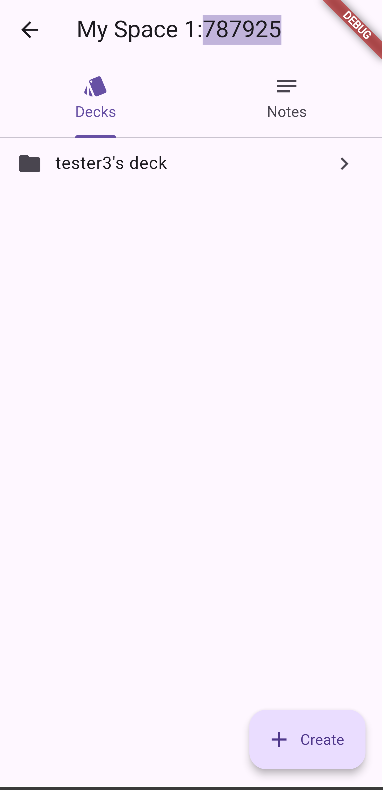

**Joinees' View:**

  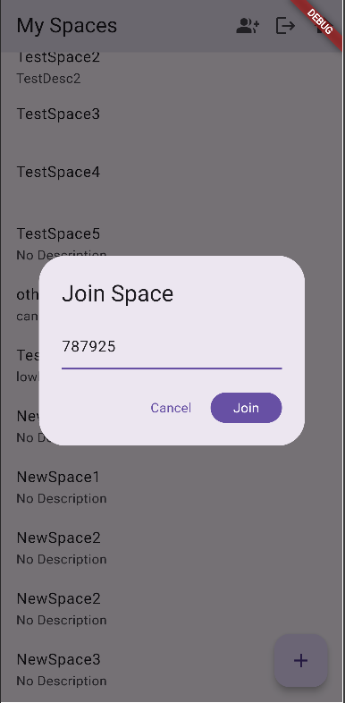
  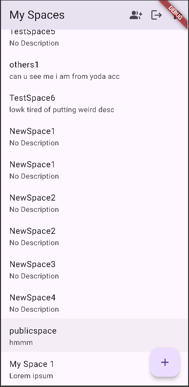

### 6. Profile Management
Users can update their personal profile, including setting an avatar via a URL or selecting an image from your gallery.

  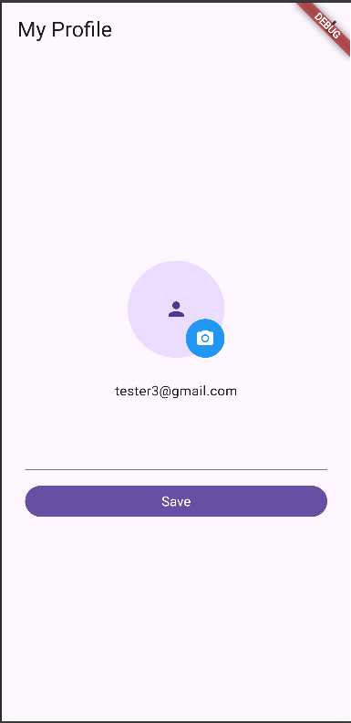

## Tech Stack

* **Frontend:** Flutter
* **Backend:** Supabase
* **State Management:** Riverpod
* **Routing:** GoRouter
* **Networking:** Dio
* **Utilities:** image_picker, shimmer
* **Editor:** flutter_quill

## Dev Plan & Tracking

### Phase 1: Foundation & Auth
- [x] Initialise Flutter project with folder structure.
- [x] Create and configure Supabase free-tier project; design full DB schema.
- [x] Integrate supabase_flutter, riverpod, and dio for the core stack.
- [x] Implement sign up, login, and logout functionality using Supabase Auth.
- [x] Build auth guard and session persistence using GoRouter redirect.

### Phase 2: Spaces & User Management
- [x] Build create space flow (name, description, visibility).
- [x] Implement join space via invite code generation and validation.
- [x] Configure RLS policies so users only access their own spaces.
- [x] Build spaces list and individual space home screen.
- [x] Add user profile screen with avatar via Supabase Storage.
- **[Bonus Feature] URL based profile pic:** Allows user to enter link of image from the internet, and uses it as the profile picture.

### Phase 3: Flashcards & Notes
- [x] Build flashcard deck list and deck creation UI within a space.
- [x] Implement add/edit/delete individual flashcards (front & back).
- [ ] Add flip animation for review mode and swipe-through study session.
- [ ] Build notes list and editing UI with flutter_quill rich text editor.
- [x] [WIP] Persist all content to Supabase with full CRUD operations.

### Phase 4: Comments, Realtime & Polish
- [ ] Build threaded comment UI on flashcards and notes.
- [ ] Set up Supabase Realtime subscriptions for live comment updates.
- [x] Polish UI with loading skeletons, empty states, and error toasts.
- [x] Handle edge cases: no internet, auth expiry, and duplicate join codes.
- [x] [WIP] Write integration tests and finalise README documentation.

### Phase 5: Intelligent Learning
- [ ] AI-Generated Flashcards: Integrate Supabase Edge Functions with an LLM API to automatically generate flashcard decks from user notes.
- [ ] Spaced Repetition System (SRS): Implement a Mastery-based review algorithm using Postgres timestamps to schedule cards for optimal retention.

## References

* [AuthExpiry for GoRouter](https://medium.com/@dudek16/migration-to-go-router-devs-story-199f4ef6ed)
* [Integration Testing](https://medium.com/@punithsuppar7795/integration-testing-in-flutter-mocking-apis-auth-flows-and-scaling-to-accessibility-1487eacdedc0)
* [Flutter Official Documentation](https://api.flutter.dev/index.html)
* [Dart Official Documentation](https://dart.dev/docs)
* [MaterialApp Official Documentation](https://api.flutter.dev/flutter/material/MaterialApp-class.html)
* [Material Widgets Official Documentation](https://docs.flutter.dev/ui/widgets/material)
* [Supabase Flutter Client Library](https://supabase.com/docs/reference/dart/initializing)
* [Supabase Flutter Getting Started](https://supabase.com/docs/guides/getting-started/quickstarts/flutter)
* [Supabase DBMS Fundamentals](https://supabase.com/docs/guides/database/overview)
* [Riverpod Getting Started Guide](https://riverpod.dev/docs/introduction/getting_started)
* [Flutter Riverpod Tutorial Playlist](https://www.youtube.com/playlist?list=PL4cUxeGkcC9i88WGZ9eIfQUWRgPstLFLp)
* [Flutter Supabase Tutorial Playlist](https://www.youtube.com/playlist?list=PL5S4mPUpp4OtkMf5LNDLXdTcAp1niHjoL)
* [Flutter Supabase Auth Tutorial](https://www.youtube.com/watch?v=njeo_g-3tPw)

AI tooling was used in a strictly limited capacity during this project. Usage was restricted to:
1. **Debugging and Ideation**
2. **Supabase Storage Integration:** Resolving errors and syntax issues while working with Supabase storage, image_picker, io.